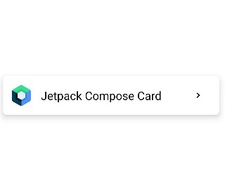

  
  
# Compose-UI
This repository contains code of different UI designs written in Compose.

  
Table of Contents

  <ol>
    <li>
      <a>Cards</a>
      <ul>
        

            
3 Element Card

              <ul>
                  <li><a href="#3-element-card">Screenshot</a>
                  <li><a href="Card/3elementCard.kt">Code</a>
              </li>
          </li>
      </ul>
    

  </ol>

#
### 3 Element Card
[][#3ElementCard]

[#3ElementCard]: Card/3elementCard.kt
[website]: https://www.tannatsri.co
[instagram]: https://www.instagram.com/tannatsri/
[linkedin]: https://www.linkedin.com/in/tannatsri/
[twitter]: https://www.twitter.com/tannatsri/
